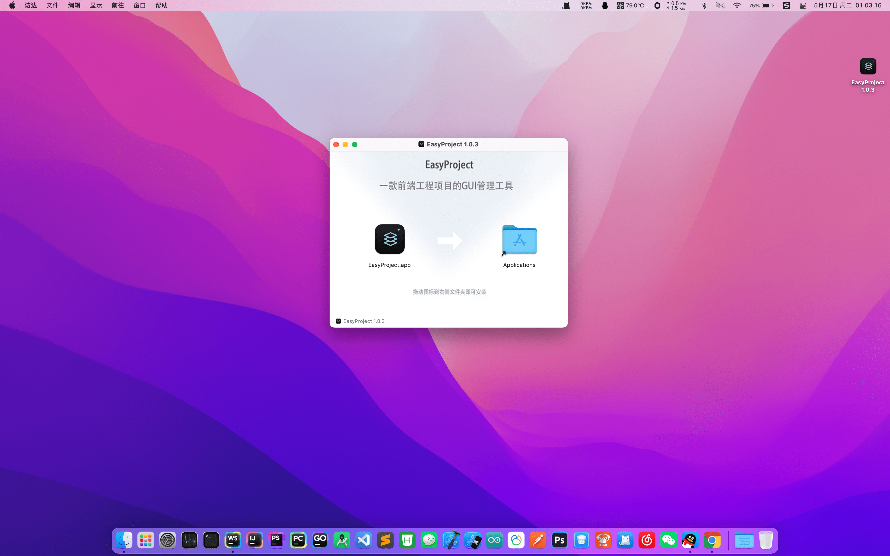
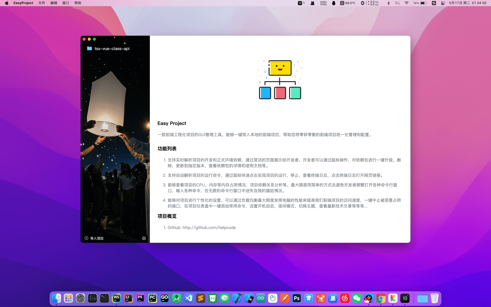
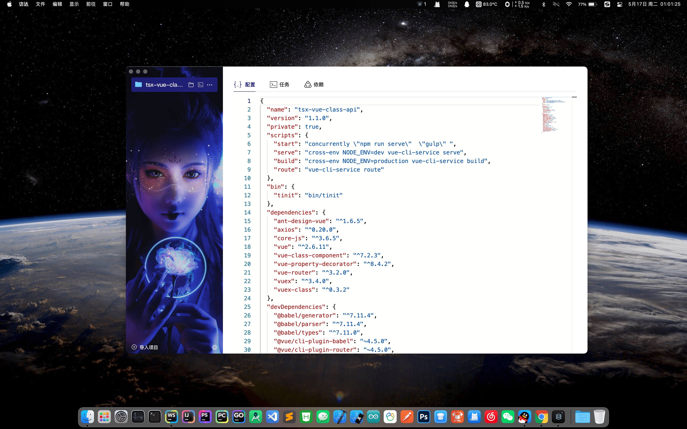

    

  一款前端工程化项目的GUI管理工具

  
  
  
  
  

## 简介

`EasyProject` 是一款`Mac`平台下的前端项目管理工具，能够一键导入本地的前端项目，帮助您将零碎零散的前端项目进行统一化GUI管理和配置，协助您提高项目开发的效率。

### 官网

> [https://helpcode.github.io/EasyProject/website/index.html](https://helpcode.github.io/EasyProject/website/index.html)

### 下载

打开链接，选最新版本，然后从`Assets`中选择`EasyProject-x.x.x.dmg`进行下载即可。

> [releases](https://github.com/helpcode/EasyProject/releases)

## 功能介绍

已实现功能：

- [x] 1: 欢迎页面
- [x] 2: 导入项目，包含从 `menu`，`touchbar`，`tray`。
- [x] 4: 移除项目，修改项目名称，图标，在访达打开，在终端打开。
- [x] 5: 读取展示 项目的 `package.json`，并实时同步软件中修改的`package.json`到本地。
- [x] 6: 读取展示 项目的 `script` 脚本，可以一键启停，复制 & 删除 终端日志，打开链接，滚动日志到底部。
- [x] 7: 当停止 `script` 脚本时，增加"进程锁"，等待子进程结束才能再次使用命令。
- [x] 8: 读取展示 项目的 `devDependencies` 和 `dependencies`， 如果当前项目没有初始化依赖，软件会自动弹窗提示询问是否进行安装，安装成功后：提供 一键安装插件，一键升级，一键删除，查看插件官方网址等功能。
- [x] 9: 自动监听已导入的项目路径，路径发生改变，软件自动移除相关项目。
- [x] 10: 提供自定义主题功能，支持本地 & 网络 上传手机壁纸，拖动调节 透明度，背景模糊度等。
- [x] 11: 可以自定义 `Node.js`解释器安装路径，避免`MacOS`通过`GUI`启动`xx.app`时出现的无法继承用户环境变量。
- [x] 12: 可根据喜好在软件中全局设置 你想要的 包管理工具。
- [x] 13: 一键勾选 是否 开机自启。
- [x] 14: 打开应用自动升级检测，或是 点击检查更新 进行新版本下载。
- [x] 15: 增加状态栏顶部 图标，实现 **杀死EasyProject** 时正在被运行的 命令进程 可以被全部关闭。
- [x] 16: 实现隐藏应用GUI，只保留顶部状态栏图标，简化操作，随取随用。

待实现功能：

- [ ] 1: 支持从`Git` 或 `SVN` 仓库导入项目
- [ ] 2: 把当前正在使用项目的所有命令放到`Touchbar上`，可以在`Touchbar`上启停。
- [ ] 3: 把项目命令运行时的内存占用，CPU占用显示在顶部菜单栏。
- [ ] 4: 修改框架创建窗口的数据存储方式，让升级弹窗基于`BrowserWindow`实现。
