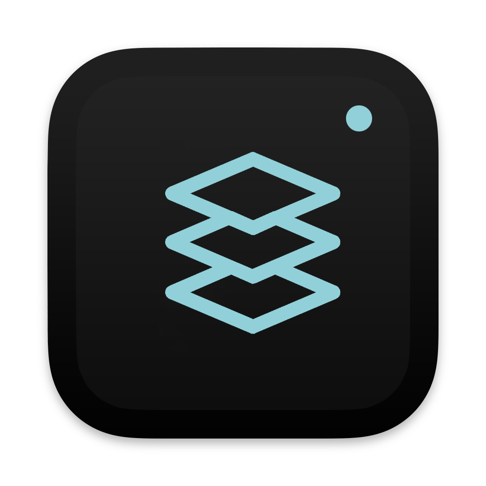

    

  一款前端工程化项目的GUI管理工具

  
  
  
  
  

## 简介

`EasyProject` 是一款`Mac`平台下的前端项目管理工具，能够一键导入本地的前端项目，帮助您将零碎零散的前端项目进行统一化GUI管理和配置，协助您提高项目开发的效率。

### 官网

> [https://helpcode.github.io/EasyProject/website/index.html](https://helpcode.github.io/EasyProject/website/index.html)

### 下载

打开链接，选最新版本，然后从`Assets`中`EasyProject-x.x.x.dmg`进行下载即可。

> [releases](https://github.com/helpcode/EasyProject/releases)

